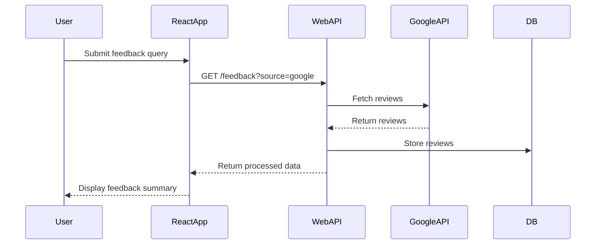
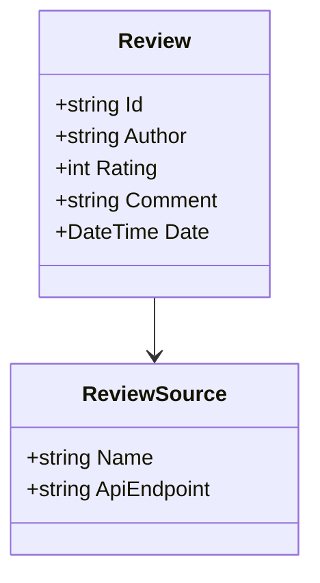

# 🧾 Software Design Specification (SDS)

## 📘 Project Overview

**Project Name:** Customer Feedback Aggregator  
**Description:** A web application that collects, analyzes, and visualizes customer feedback from multiple third-party platforms (e.g., Google Reviews, Trustpilot).  
**Tech Stack:**  
- **Frontend:** React (TypeScript)  
- **Backend:** .NET 9 (Clean Architecture)  
- **Database:** PostgreSQL  
- **APIs:** Google Reviews API, Trustpilot API  

---

## 📐 1. Architecture Overview

:::mermaid
graph TD
    A[React Frontend] -->|REST API| B[.NET 9 Web API]
    B --> C[Application Layer]
    C --> D[Domain Layer]
    C --> E[Infrastructure Layer]
    E --> F[(PostgreSQL DB)]
    E --> G[Google Reviews API]
    E --> H[Trustpilot API]
:::

---

## 🧱 2. System Components

### 2.1 Frontend (React)

- **Pages:** Dashboard, Review Details, Settings
- **State Management:** Redux Toolkit
- **API Communication:** Axios with JWT authentication
- **Routing:** React Router v6

### 2.2 Backend (.NET 9)

- **Presentation Layer:** ASP.NET Core Web API
- **Application Layer:** Use cases, DTOs, interfaces
- **Domain Layer:** Entities, value objects, domain events
- **Infrastructure Layer:** EF Core, API clients, logging

---

## 🔄 3. Data Flow



---

## 🧩 4. Key Use Cases

### 4.1 Fetch and Display Reviews

- **Actor:** Authenticated User
- **Trigger:** User selects a review source
- **Flow:**
  1. Frontend sends request to backend.
  2. Backend fetches data from third-party API.
  3. Data is stored and returned to frontend.

---

## 🧪 5. API Contracts

### `GET /api/reviews?source=google`

- **Request Headers:** `Authorization: Bearer <token>`
- **Response:**
```json
[
  {
    "id": "rev123",
    "author": "Jane Doe",
    "rating": 4,
    "comment": "Great service!",
    "date": "2025-07-01"
  }
]
```

---

## 🧠 6. Domain Model



---

## 🛠️ 7. Infrastructure Details

- **Database:** PostgreSQL with EF Core
- **External APIs:** Google Reviews, Trustpilot
- **Authentication:** JWT-based
- **Logging:** Serilog with Seq

---

## 🔐 8. Security Considerations

- All API endpoints require JWT authentication.
- Sensitive data is masked in logs.
- Rate limiting is applied to third-party API calls.

---

## 📊 9. Non-Functional Requirements

| Requirement         | Value                     |
|---------------------|---------------------------|
| Availability        | 99.9% uptime              |
| Response Time       | < 500ms for 95% of calls  |
| Scalability         | Horizontally scalable     |
| Logging             | Centralized with Serilog  |

---

## 🧪 10. Testing Strategy

- **Unit Tests:** xUnit for backend, Jest for frontend
- **Integration Tests:** API + DB
- **E2E Tests:** Playwright

---

## 📅 11. Milestones

| Milestone               | Target Date |
|-------------------------|-------------|
| API Integration         | Aug 15, 2025|
| Frontend MVP            | Aug 30, 2025|
| Full System Testing     | Sep 10, 2025|
| Production Deployment   | Sep 20, 2025|
